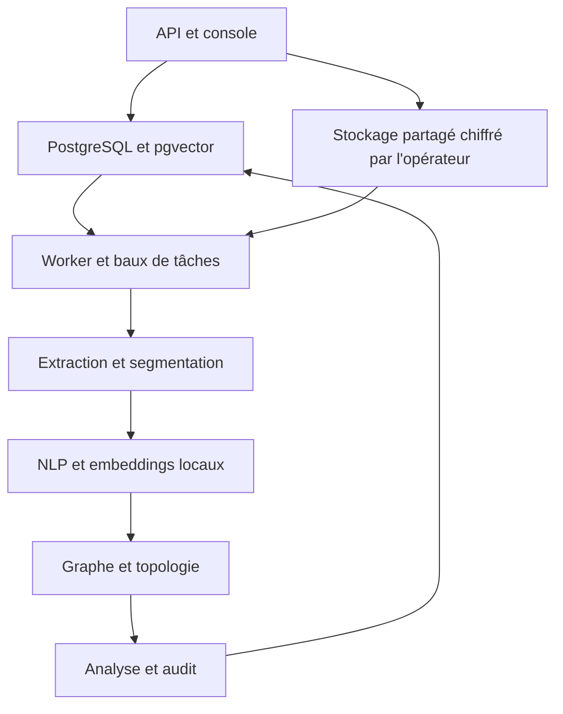

# Mass Classification

Plateforme Python d’ingestion, de classification et d’exploration de pièces volumineuses, orientée données bancaires et enquêtes. Les résultats relient les signaux à des documents et restent soumis à une **revue humaine**. Aucun score heuristique ne constitue une probabilité de fraude, une preuve d’intention ou une conclusion policière.

Le [guide fourni](GUIDE_CONSTRUCTION_PLATEFORME_COMPLETE.md) décrit des techniques confirmées, proposées et hypothétiques. Ce dépôt en transforme une partie en code exploitable et **identifie explicitement les composants dépendant de données, de validation ou d’infrastructure**. Il n’annonce pas une performance de 10 millions de documents sans essai de charge.

## Essayer l’interface en local

Le mode découverte ouvre une vraie interface et fournit trois documents **entièrement fictifs**. Il fonctionne avec une base SQLite locale, sans Docker, clé API, PostgreSQL ni téléchargement de modèle :

```bash
python -m pip install -r requirements-demo.txt
python -m mass_classification.demo
```

Ouvrir ensuite **http://127.0.0.1:8000/** dans le navigateur. Aucun compte n’est demandé dans ce mode ; le serveur n’écoute que sur `127.0.0.1`. Pour changer de port : `python -m mass_classification.demo --port 8080`.

Depuis l’écran d’accueil, ouvrir une pièce d’exemple, rechercher `virement Nova`, suivre un lien dans **Relations**, puis enregistrer une revue. On peut aussi importer un fichier UTF-8 `.txt`, `.md`, `.csv`, `.tsv`, `.json` ou `.eml` de 5 Mio maximum et télécharger CSV/PDF. Les imports et revues restent dans `.mass-demo/demo.sqlite3` sur cette machine. Pour repartir des exemples initiaux, arrêter le serveur puis supprimer le dossier `.mass-demo` ; cela efface aussi les imports et revues locaux.

**Portée du mode découverte :** l’import est traité immédiatement, la recherche est lexicale et les thèmes sont suggérés par des règles simples. Il ne lance ni les modèles d’embeddings, ni l’OCR, ni la transcription, ni le réseau neuronal de la plateforme complète. La bannière ambre de l’interface rappelle cette différence. Pour tester le pipeline complet avec vos propres pièces, suivre le démarrage Docker ci-dessous.

## Démarrage

Pré-requis : Docker avec Compose, une machine disposant d’espace disque pour les modèles, Tesseract et FFmpeg fournis par l’image. Déploiement derrière un proxy TLS configuré par l’opérateur.

```bash
cp .env.example .env
# Modifier POSTGRES_PASSWORD et la même valeur dans DATABASE_URL ; choisir ALLOWED_ORIGINS.
docker compose build
docker compose up -d db redis
docker compose run --rm api python -m mass_classification.admin create-key --tenant default --role admin
# Conserver la clé affichée une seule fois dans un coffre de secrets.
docker compose up -d api worker
curl http://127.0.0.1:8000/health/ready
```

Interface locale : `http://127.0.0.1:8000/`. Documentation API interactive : `/docs`. La branche de production ne doit être exposée qu’à travers HTTPS. Le premier lancement peut télécharger le modèle de phrases et le modèle de transcription si aucun cache local n’est préchargé. En environnement isolé, précharger les modèles approuvés dans les volumes avant l’ouverture des services, configurer leurs chemins et bloquer toute sortie réseau au niveau du réseau d’exécution.

Exemple d’import, de consultation et de recherche :

```bash
export MASS_API_KEY='mc_...'
curl -H "Authorization: Bearer $MASS_API_KEY" -F file=@exemple.txt -F 'source_json={"case":"D-17"}' http://127.0.0.1:8000/v1/documents
curl -H "Authorization: Bearer $MASS_API_KEY" http://127.0.0.1:8000/v1/documents
curl -H "Authorization: Bearer $MASS_API_KEY" -H 'Content-Type: application/json' -d '{"query":"virement inhabituel"}' http://127.0.0.1:8000/v1/ask
```

L’API répond `202` à l’import ; le worker publie ensuite `queued`, `processing`, `ready` ou `failed`. Rejouer un même fichier dans un tenant renvoie l’ID existant. Les questions restituent des **extraits** et des IDs de pièces, sans génération libre.

## Architecture et chemin d’une pièce



- **Ingestion** : flux HTTP limité à 50 Mio, SHA-256, noms de fichier neutralisés, copie sur volume par tenant, tâche persistée ; les doublons sont dédupliqués dans le tenant.
- **Extraction** : texte/code/HTML/CSV/JSON/XML/YAML, PDF avec OCR de repli, images avec OCR et métadonnées, DOCX, XLSX, EML, MSG, ZIP borné, audio avec Whisper local, vidéo avec FFmpeg, échantillonnage d’images et transcription. Extraction sans ouverture des liens contenus dans la pièce. La reconnaissance faciale et l’extraction fiable de schémas graphiques ne sont pas implémentées.
- **Analyse** : détection de langue et d’entités spaCy, montants, relations par règles sourcées, sentiment VADER **uniquement pour l’anglais**, statistiques lexicales, priorité de revue par règles. Des fonctions isolées calculent anomalies robustes et coïncidences temporelles ; elles ne sont pas invoquées sur des événements dépourvus de provenance temporelle.
- **Vecteurs** : modèle multilingue local de 384 dimensions, segments chevauchants, recherche par distance cosinus pgvector, au plus 500 segments indexés par pièce. L’indicateur `embedding_truncated` signale la coupure. Les entités sont normalisées par type et nom exact ; aucune fusion floue automatique.
- **Graphe** : entités, mentions et relations extraites de passages précis. Les statistiques de topologie utilisent les **relations extraites par règles**, limitées à 20 entités par document ; ces arêtes restent des indices à examiner, sans conclusion automatique. Incidences orientées, triangles, composantes, cycles du graphe et homologie persistante GUDHI bornée.
- **Réseau topologique** : deux couches de messages entre nœuds, arêtes et faces, attention, tête de classes et tête de score. Les poids ne sont utilisés que si un point de contrôle `approved.pt` a été placé par l’opérateur et accompagné de `approved.json`. Sans poids entraînés/validés, `predictions.status=unavailable` ; aucun score neural inventé.
- **Sortie** : REST, tableau de bord responsive, recherche extractive avec citations, journal d’accès et de revue, export CSV/PDF. Application installable avec **coque hors ligne uniquement** ; les données d’enquête ne sont jamais mises en cache dans le navigateur par le service worker.

## API et rôles

| Route | Rôle | Usage |
| --- | --- | --- |
| `POST /v1/documents` | admin, analyst | importer et mettre en file |
| `GET /v1/documents`, `GET /v1/documents/{id}` | tous | lister, lire une pièce et ses analyses |
| `POST /v1/search`, `POST /v1/ask` | tous | chercher des passages et obtenir des citations |
| `GET /v1/graph` | tous | voir les relations attestées par passage |
| `GET /v1/timeline`, `GET /v1/documents/{id}/explanation` | tous | dates avec leur provenance, attribution SHAP des règles |
| `GET /v1/entities/candidates` | admin, analyst | suggestions de noms similaires |
| `POST /v1/entities/merge` | admin | fusion revue et auditée |
| `POST /v1/documents/{id}/feedback` | admin, analyst | enregistrer une revue |
| `GET /v1/exports/documents.csv`, `GET /v1/documents/{id}/report.pdf` | admin, analyst | exporter |
| `GET /v1/audit`, `GET /metrics` | admin | journal et métriques |
| `GET /v1/audit/verify` | admin | vérifier la chaîne des nouveaux événements |
| `GET /v1/monitoring` | admin | statuts, backlog, versions, retours humains |
| `GET /health/live`, `GET /health/ready` | public interne | sondes |

Les clés sont générées en CLI, stockées sous empreinte SHA-256, liées à un tenant et révocables via `python -m mass_classification.admin revoke-key --key-id UUID`. Toutes les lectures et mutations applicatives filtrent par `tenant_id`. Les limites par clé passent par Redis et échouent fermées si Redis ne répond pas. Les clés d’API, le trafic TLS et les volumes chiffrés dépendent de la configuration de l’opérateur. Les comptes de base de données ne sont jamais confiés aux utilisateurs finaux.

## Connecteurs

La CLI `mass-connector` supporte `files`, `rss`, `s3`, `sql` (SELECT configuré par opérateur), `mongodb`, `sftp` (clé et hôte connus) et `kafka`. Exemple :

```json
{"kind":"files","directory":"/data/import","glob":"*.csv"}
```

```bash
MASS_API_KEY='mc_...' mass-connector --config connector.json --api https://mass.example.org
```

L’API HTTP sert également à une intégration autorisée avec un fournisseur de réseaux sociaux ou de stockage. La collecte de Twitter/X, Reddit ou de flux propriétaires nécessite un connecteur autorisé et les droits correspondants ; ce dépôt ne prétend pas disposer d’un accès universel à ces données. Les événements Kafka sont validés par l’API avant validation de l’offset. Déployer le connecteur via votre ordonnanceur et maintenir ses marqueurs de progression externes pour les sources par interrogation.

## Modèles et validation

Le script `mass-train --dataset cases.npz --output /var/lib/mass/models/candidate.pt --classes banking media other` entraîne un modèle topologique sur des **graphes de cas annotés par des personnes**. Chaque objet `samples` du NPZ contient `nodes` (N × 384), `b1` (N × E), `b2` (E × F), `label` (indice de classe) et `risk` (cible entre 0 et 1). L’entraînement exige au moins 20 cas, sépare 80/20 et écrit une précision de validation. Un jeu de 20 cas ne suffit pas à autoriser l’usage opérationnel ; effectuer validation indépendante, calibration, dérive et revue juridique avant de renommer les sorties en `approved.pt` et `approved.json`. Charger uniquement des NPZ préparés par l’équipe d’exploitation : ce format peut contenir des objets Python.

Les règles `rules:v1` sont une base explicable, pas un classificateur supervisé. SHAP explique uniquement leur priorité, sur demande. La résolution de coréférence, l’extraction neuronale de relations, les embeddings de graphe entraînés, SHAP pour le TNN, la prévision d’action et les classes fraude/crédibilité **ne sont pas validées** en l’absence de corpus annoté et de vérité terrain. L’attention d’un réseau n’établit pas une cause. Conserver dans les rapports la version du modèle, les limitations et l’élément de preuve.

Pour adapter les embeddings à un tenant, préparer un TSV `text_a<TAB>text_b<TAB>similarity` (en-tête inclus), puis exécuter `mass-tune-embeddings --pairs paires.tsv --base-model <modele-local> --output /var/lib/mass/models/tenant-v2`. L’évaluation utilise 20 % de paires retenues. Mettre ensuite `EMBEDDING_MODEL` sur le chemin validé et **réindexer tous les segments du tenant** avant toute recherche, faute de quoi la comparaison de vecteurs issus de deux modèles n’a aucun sens. La commande `mass-reindex` ci-dessous réalise une bascule transactionnelle pendant une fenêtre de maintenance.

## Exploitation et sécurité

1. Publier l’image immuable via CI, analyser les dépendances et figer les versions/digests lors de la promotion ; le `pyproject.toml` utilise actuellement des bornes de versions, pas un verrou reproductible.
2. Déployer PostgreSQL/pgvector, Redis, stockage partagé, modèle approuvé, secrets, certificat TLS et politiques réseau. Compose fournit un environnement mono-hôte ; `deploy/k8s/mass.yaml` montre le déploiement API/worker sur volumes RWX et attend des services PostgreSQL/Redis gérés et des secrets externes.
3. Chiffrer les volumes et les sauvegardes au niveau de l’infrastructure. Sauvegarder PostgreSQL **et** le volume de pièces au même point de cohérence, tester la restauration et définir rétention/suppression selon le dossier. Le journal SQL est traçable mais non immuable face à l’administrateur DB ; exporter les événements vers un journal append-only si la chaîne de conservation l’exige.
4. Placer le proxy HTTPS devant l’API ; limiter les accès à `/docs`, `/metrics` et aux sondes selon votre réseau. Superviser la profondeur des tâches, les erreurs, les délais de traitement et les métriques Prometheus. Un worker reprend les baux expirés, jusqu’à trois essais avec délai croissant.
5. À grande échelle, créer après chargement un index par tenant/partition adapté : `CREATE INDEX CONCURRENTLY ... USING hnsw (embedding vector_cosine_ops)` sur `chunks`. Le filtre par tenant peut dégrader le rappel ANN : vérifier plan SQL, rappel et isolation avant l’activation. Partitionnement, bascule de base, stockage objet et tests de charge sont à dimensionner sur vos données.

L’application ne télécharge aucun modèle à l’exécution si les caches locaux ont été préchargés. Des poids manquants ou incompatibles ne sont jamais remplacés par une prédiction synthétique. Les vidéos et transcriptions consomment beaucoup de CPU : limiter leur volume et allouer des workers distincts selon la charge. Pour les données bancaires et d’enquête, éviter les comptes partagés, documenter les durées de conservation et faire approuver les traitements de données sensibles.

## Vérification

```bash
python -m pip install -e '.[test,topology]'
python -m compileall -q mass_classification
python -m pytest -q
docker compose build
```

Les tests unitaires vérifient extraction sûre, complexité bornée, incidence simpliciale, homologie d’un triangle, anomalies, règles et auth. Un essai de bout en bout exige PostgreSQL, Redis, modèles téléchargés, OCR et image Docker. Le pipeline CI construit l’image et exécute les tests ; il ne simule pas 10 M de pièces.

## Couverture du guide et limites de cette livraison

| Thème du guide | Réalisé | Prérequis ou travail restant avant une mise en production réglementée |
| --- | --- | --- |
| Formats texte, image, audio, vidéo | extraction et garde-fous, OCR/ASR locaux | formats rares, flux vidéo continu, validation de qualité OCR et reconnaissance faciale selon cadre légal |
| Connecteurs et flux | CLI fichiers/RSS/S3/SQL/Mongo/SFTP/Kafka ; API | points de reprise pour polling, intégrations propriétaires et permissions |
| NLP, relations, signaux | spaCy, règles, langue, sentiment anglais, anomalies temporelles utilitaires | corpus métier et extraction neuronale, coréférence, géolocalisation fiable |
| Embeddings et graphe | phrase multilingue, adaptation et réindexation par tenant, mentions, relations, topologie | validation de l’adaptation, désambiguïsation supervisée, graphe distribué |
| TNN et prédictions | architecture et entraînement hors ligne ; absence de poids signalée | corpus labellisé suffisant, calibration, validation indépendante, promotion du modèle |
| Interprétabilité | règles, passages et provenance, SHAP sur priorité par règles, attention si modèle | SHAP sur modèle validé, comparables historiques autorisés, contrôle de dérive |
| API, interface, export, audit | service et console responsive, CSV/PDF, revue et journal | journal inviolable, politique de rétention, fédération SSO, reportings approfondis |
| Résilience et échelle | tâches SQL avec bail, retry, Docker, référence Kubernetes | bascule/backup gérés, partitions/ANN, supervision SLA, essais de charge |
| Mobile et hors ligne | interface responsive et exemple fictif PWA hors ligne | analyse de pièces hors ligne et application mobile native |

Les estimations de coût, latence, capacité et qualité du guide sont des **hypothèses**, non des résultats mesurés pour ce dépôt.

## Licence et contribution

Voir [LICENSE](../LICENSE). Proposer des tests sur données synthétiques ; ne jamais committer de données bancaires, dossiers d’enquête, clés, checkpoints non autorisés ni fichiers `.env`.

## Extensions SHOULD HAVE et NICE TO HAVE

Cette section décrit le **comportement réel** de la branche. « Disponible » signifie que l’interface ou l’API existe ; cela ne vaut pas validation métier sur des données sensibles.

| Point du guide | État vérifiable | Limite pratique |
| --- | --- | --- |
| Homologie persistante | `topology.persistent_homology` via GUDHI sur les arêtes extraites | Graphes bornés, relations par règles ; résultat descriptif |
| Attention avancée | Attention multi-tête sur nœuds après propagation simpliciale, puis agrégation pondérée ; `tnn.py` | Nécessite **de nouveaux** poids entraînés et validés ; les anciens checkpoints ne sont pas compatibles |
| SHAP | `GET /v1/documents/{id}/explanation`, calcul exact du score `rules:v1` avec une référence nulle | SHAP est optionnel en installation Python (`.[explain]`) et inclus dans l’image ; explique une règle, pas un modèle TNN ni une cause |
| Tableau de bord et Q&A | Interface responsive, recherche sourcée et `POST /v1/ask` | Réponse extractive, sans génération libre |
| Traitement rapide | Worker avec bail SQL et reprise ; l’interface vérifie l’état environ toutes les 5 secondes après import | Pas de flux continu garanti ni de SLA temps réel |
| Images, audio et vidéo | OCR, transcription et images vidéo échantillonnées avec composants locaux | Qualité et ressources dépendantes des modèles/médias |
| Déduplication d’entités | Suggestions `GET /v1/entities/candidates` ; fusion administrateur `POST /v1/entities/merge` avec conservation de l’alias | Comparaison des 250 premières entités du tenant, suggestions de nom uniquement ; aucune fusion automatique |
| Modélisation temporelle | `GET /v1/timeline` et onglet Chronologie : `source.event_at` ISO 8601 horodaté si fourni, sinon date d’import explicitement marquée | Pas d’inférence fiable de date à partir du texte ; statistiques temporelles avancées restent utilitaires |
| GPU | `MASS_DEVICE=cuda` pour embeddings et inférence TNN ; échec explicite si CUDA absent | Image GPU PyTorch, pilote et GPU doivent être fournis par l’opérateur ; aucune mesure de gain annoncée |
| Kubernetes | Déploiements, service, sondes, HPA API, PDB, politique d’entrée et exemple de patch GPU | Manifeste de référence ; services gérés, secrets, stockage RWX, TLS, métriques et politique réseau du cluster à préparer |
| Visualisation avancée | Carte SVG accessible des 20 premiers nœuds, liste de preuves et chronologie | Vue bornée, non représentative d’un graphe complet ; aucune analyse visuelle causale |
| Adaptation client | `mass-tune-embeddings` et `mass-reindex --tenant ...` ; modèle et index propres au tenant | Paires annotées, validation indépendante, interruption de maintenance lors de la réindexation |
| Mobile | Interface responsive avec manifeste PWA installable selon navigateur | Pas d’application iOS/Android native ni de synchronisation de dossiers |
| Hors ligne | Service worker met en cache uniquement `offline.html` fictif, CSS et icône | Les pièces et API ne sont jamais mises en cache ; aucune analyse hors ligne |
| Multitenant | Clés et requêtes filtrées par tenant, modèles d’embeddings activables séparément | Isolation applicative ; comptes DB, volumes et contrôles externes restent de la responsabilité de l’exploitant |
| Audit renforcé | Chaîne SHA-256 par tenant pour **nouveaux** événements, séquencée sous verrou ; `GET /v1/audit/verify` | Les événements antérieurs à la migration sont signalés `legacy_unsealed` ; un administrateur DB peut réécrire la chaîne entière sans ancrage externe |

### Utiliser les nouvelles fonctions

```bash
# Fournir une date d’événement de la source, si elle est connue et documentée.
curl -H "Authorization: Bearer $MASS_API_KEY" -F file=@exemple.txt \
  -F 'source_json={"case":"D-17","event_at":"2026-04-14T10:30:00+02:00"}' \
  http://127.0.0.1:8000/v1/documents
curl -H "Authorization: Bearer $MASS_API_KEY" http://127.0.0.1:8000/v1/timeline
curl -H "Authorization: Bearer $MASS_API_KEY" http://127.0.0.1:8000/v1/entities/candidates
curl -H "Authorization: Bearer $MASS_API_KEY" http://127.0.0.1:8000/v1/audit/verify
```

Pour calculer SHAP, consulter une pièce analysée puis appeler `GET /v1/documents/{id}/explanation`. Les trois contributions (`money_mentions`, `domains`, `urgency_mentions`) s’additionnent à la priorité affichée après plafonnement à 100 ; le niveau de référence est zéro. Un modèle neural entraîné a besoin d’une méthode d’explication et d’une évaluation distinctes.

La fusion d’entités demande le rôle `admin` :

```bash
curl -X POST -H "Authorization: Bearer $MASS_API_KEY" \
  -H 'Content-Type: application/json' \
  -d '{"source_id":"UUID_ENTITE_A_REMPLACER","target_id":"UUID_ENTITE_CONSERVEE"}' \
  http://127.0.0.1:8000/v1/entities/merge
```

Comparer les mentions et passages avant l’appel. La fusion déplace mentions, relations et alias vers l’entité conservée, puis journalise les identifiants ; elle n’est pas une simple suggestion annulable automatiquement. Les noms et types doivent appartenir au même tenant et au même type.

### Modèle d’embeddings propre à un tenant

1. Préparer au moins 100 paires de phrases relues, séparées par tabulations (`text_a`, `text_b`, `similarity`). Conserver des exemples d’évaluation indépendants supplémentaires.
2. Entraîner hors ligne : `mass-tune-embeddings --pairs paires.tsv --base-model /chemin/modele-base --output /var/lib/mass/models/tenants/atlas/embedding`.
3. Valider le modèle, les erreurs, la dimension 384 et son droit d’utilisation. Placer le dossier sur le volume `MODEL_DIR` visible par l’API et le worker.
4. Pendant une fenêtre de maintenance **du tenant** et après sauvegarde : `mass-reindex --tenant atlas`. Cette commande verrouille le tenant, vérifie le modèle, recalcule tous ses segments et active ce modèle dans la même transaction. Une erreur annule l’ensemble ; sur un gros volume, prévoir une migration par double index et bascule contrôlée plutôt que cette transaction longue.
5. Redémarrer les services si le modèle était déjà chargé en cache, puis contrôler recherche, latence et rappel. Les autres tenants conservent leur modèle ; le modèle de base reste défini par `EMBEDDING_MODEL`.

### Exploitation Kubernetes et audit

Remplacer le registre et le tag d’image de `deploy/k8s/mass.yaml` par un digest immuable. Fournir `mass-config` (`DATABASE_URL`, `REDIS_URL`, `DATA_DIR`, `MODEL_DIR`, etc.), les volumes `mass-data-rwx` et `mass-models`, PostgreSQL/pgvector, Redis et la collecte des métriques CPU avant de déployer. La politique d’entrée autorise seulement les namespaces marqués `mass-api-clients: "true"` : y placer la passerelle interne. TLS, sorties réseau et permissions DB restent à configurer dans le cluster. Le patch `deploy/k8s/gpu-worker.patch.yaml` est **un exemple**, utilisable seulement avec un image CUDA et un device plugin compatibles ; le manifeste standard fonctionne sur CPU.

`/v1/audit/verify` recalcule la chaîne et retourne `valid`, `checked`, `legacy_unsealed` et `head_hash`. Exporter périodiquement le `head_hash` vers un support externe à la base pour détecter une réécriture par un administrateur DB. Les événements existant avant la migration 002 restent lisibles mais ne sont pas rétroactivement certifiés. Vérifier la restauration de la base **avec** sa chaîne et comparer l’ancre externe.

### Installation hors Docker et tests

```bash
python -m pip install -e '.[topology,explain,test]'
python -m pytest -q
```

Les tests locaux portent sur la provenance des dates, les suggestions limitées par type, les variations d’empreintes, le parcours découverte et les règles. Les opérations transactionnelles PostgreSQL, CUDA, OCR/ASR réel et la charge doivent encore être testées sur une infrastructure représentative. Le mode découverte expose la chronologie et la carte, mais pas la fusion ni SHAP : il sert uniquement aux exemples fictifs.
